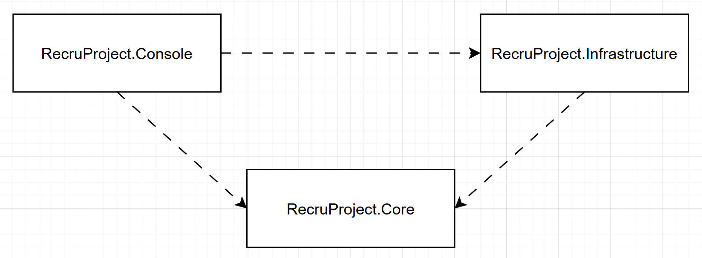

# Recruitment "Orders" project
## Project overview
This project was developed as part of a recruitment process.

It provides basic functionality for creating and retrieving "Order" entities, serving as a simple domain example.

The main goal of this project is to demonstrate clean code principles, best programming practices, and a clear, maintainable architecture.

## How to run
1. Clone repository 
2. Make sure that you have .NET 9 SDK installed - Use `dotnet --info` command to verify
3. Build solution in Release (choose one approach)
    - You can use IDE
    - run `dotnet build -c Release` in solution directory
4. Navigate to `...\RecruProject.Console\bin\Release\net9.0`
5. Run app  `.\RecruProject.Console.exe`

You can change `appsettings.json` `logLevel` variable to `Error`. It will hide all `Info` logs. 

## Architecture
Simplified Clean Architecture

## Technology Stack & used Libraries
- C#
- .Net 9
- Microsoft.Extensions.Configuration - 9.0.14
- Microsoft.Extensions.Configuration.Json - 9.0.14
- Microsoft.Extensions.DependencyInjection - 9.0.14
- xunit - 2.9.2
- Moq - 4.20.72
- AwesomeAssertions - 9.4.0

## List of completed bonus tasks
All bonus tasks were completed
1. Asynchronous Processing
2. Add Order (CRUD)
3. IOrderValidator
4. Unit Tests
5. Configuration via appsettings.json
6. Notification Service